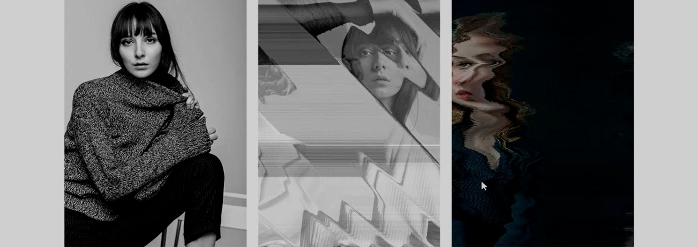

# WebGL images animation with curtainsJS & GSAP

Hover animation created with WebGL for images transition with Curtainjs & GSAP. The images are used as displacement, vertex modifiers & fragment shaders. 





I was making this animation at the same time as this one that I just published, [Animación de slideshow usando WebGL con librería curtainsJS](https://ivanalbizu.eu/blog/webgl-slideshow/), to know what things you can do with WebGL & [https://www.curtainsjs.com/](https://www.curtainsjs.com/).

In the previous publication I created the animation with 2 textures & one **displacement** image triggered with the **click** event.

In this post, the events triggering the animation are **mouseenter** & **mouseout**. There's 3 images as textures. The first is displayed as the initial state, the second one as the hover state & the last one as the fusion of both during the transition. 

I have placed 6 differents animations, with their proper images. My initial idea was to use it on the Homepage of an e-commerce inside a grid of products, but the effect uses a lot of GPU & I deleted it. With time & practice I will have to learn more & see if I can improve the performance. In Firefox, the animation is fluid when used on one image, but seems laggy when used on 6.

[Link to the codepen](https://codepen.io/ivan_albizu/pen/ZEOeWam)

##Class properties.
Inside the constructor of WebglHover class, we define the needed attributes

```js
class WebglHover {
  constructor(set) {
    this.canvas = set.canvas
    this.webGLCurtain = new Curtains({
      container: this.canvas,
      watchScroll: false,
      pixelRatio: Math.min(1.5, window.devicePixelRatio)
    })
    this.planeElement = set.planeElement
    this.mouse = {
      x: 0,
      y: 0
    }
    this.params = {
      vertexShader: document.getElementById("vs").textContent,
      fragmentShader: document.getElementById("fs").textContent,
      widthSegments: 40,
      heightSegments: 40, // 40*40*6 = 9600 vertices
      uniforms: {
        time: {
          name: "uTime",
          type: "1f",
          value: 0
        },
        mousepos: {
          name: "uMouse",
          type: "2f",
          value: [0, 0]
        },
        resolution: {
          name: "uReso",
          type: "2f",
          value: [innerWidth, innerHeight]
        },
        progress: {
          name: "uProgress",
          type: "1f",
          value: 0
        }
      }
    }
    this.initPlane()
  }
}
```

The class instance gives us the WebGL context & add the canvas to the container. It will receive as parameter an object with the elements of the DOM :
1. ```<div class="canvas"></div>```: div wwhere the canvas will be created with curtainsJS. 
2. ```<section class="plan"></section>```: the div where we will place the 3 images with curtainsJS to created the textures, with the **data-sampler** attribute to pass it to the **fragment shader**

We create an instance of CurtainsJS to obtain the DOM element for the plane & one object with the mouse position. 

With ```this.params={}``` we define the shaders & their segments. Inside ```uniforms``` we define the KEYS needed to modify the shaders: 

* time: ```uTime```
* mousepos: ```uMouse```
* resolution: ```uReso```
* progress: ```uProgress```

Finally, we call ```initPlane()``` to initiate the app. This method make the call at two other methods if the plane is ready. 

## Instantiate the WebGL plane
```js
initPlane() {
  this.plane = new Plane(this.webGLCurtain, this.planeElement, this.params)

  if (this.plane) {
    this.plane.onReady(() => {
      this.update()
      this.initEvent()
    })
  }
}
```

The plane is created inside this method, using the ```Plane``` class of curtainsJS. If the plane has been correctly created, when it's ready, we make the call to ```update()``` & initiate the events ```initEvent()```

##Render of the WebGL plane

```js
update() {
  this.plane.onRender(() => {
    this.plane.uniforms.time.value += 0.01

    this.plane.uniforms.resolution.value = [innerWidth, innerHeight]
  })
}
```
The value of ```time``` & ```resolution``` of the ```params``` object are updated.

## Register of the events for WebGL

```js
initEvent() {
  this.planeElement.addEventListener("mouseenter", () => {
    gsap.to(this.plane.uniforms.progress, .8, {
      value: 1
    })
  })

  this.planeElement.addEventListener("mouseout", () => {
    gsap.to(this.plane.uniforms.progress, .8, {
      value: 0
    })
  })
}
```

We register the events ```mouseenter``` & ```mouseleave``` to the planes. With the help of the ```GSAP``` library, when the mouse enters & leaves the images, the value of ```progress``` is updated in order to display one or another image. The effect lasts for 800ms.

## Instantiation of the WebglHover class
```js
document.querySelectorAll('.slide').forEach(slide => {
  const canvas = slide.querySelector('.canvas')
  const planeElement = slide.querySelector('.plane')
  new WebglHover({
    canvas,
    planeElement
  })
})
```

We save all the DOM elements that have the ```slide``` class & we create the instance passing the references ```<div class="canvas">``` & ```<div class="plane">``` as parameters

## HTML of the WebGL 

```html
<main class="slides">
  <section class="slide">
    <div class="canvas"></div>
    <div class="plane">
      
      
      
    </div>
    <div class="slide__content">
      <p>Lorem ipsum dolor sit.</p>
    </div>
  </section>
  <section class="slide"></section>
</main>
```

The HTML structure is important. The ```slides``` container is the main container & we can place as much slides as we want. 
```<div class="canvas">``` will be used by ```curtainJS``` to create the ```canvas``` element.

Inside ```<section class="plane">``` we will place all the images with the ```data-sampler``` attributes. Be aware that the last image will be used as the transition between both. 

## CSS code
I won't go through the CSS explication as it has nothing special. You can find the code on the github repository ;)